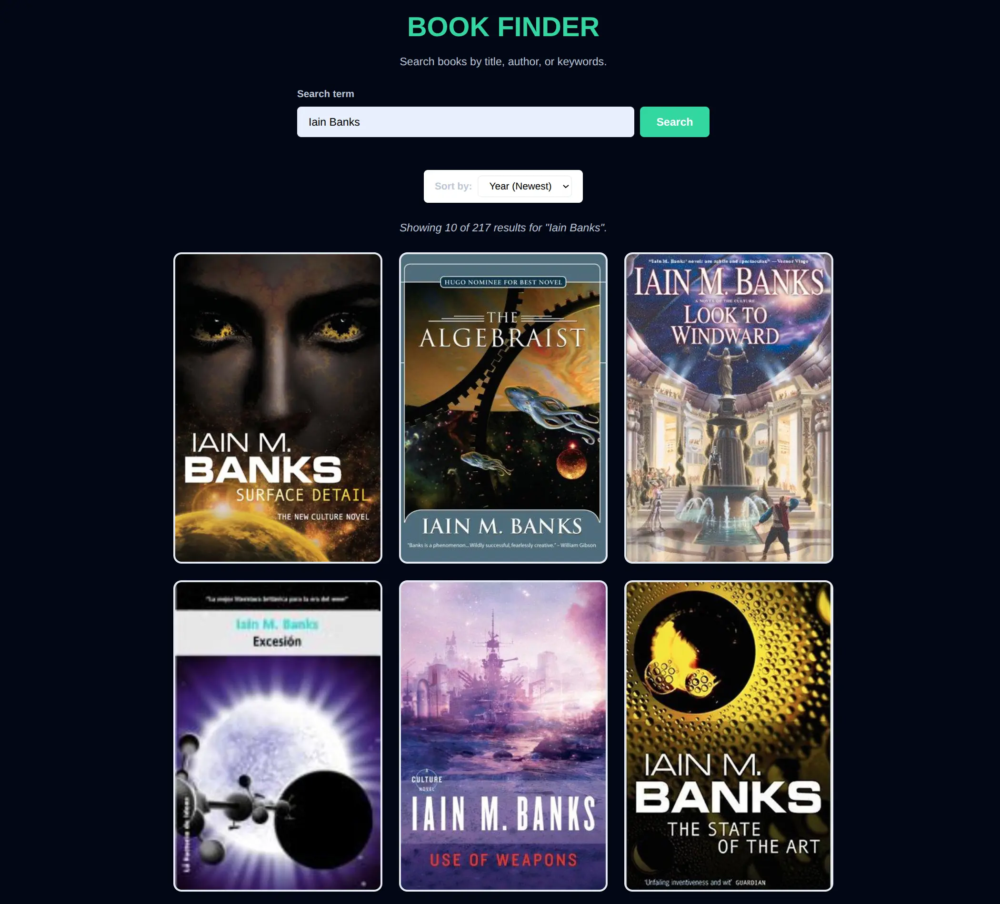

# Book Finder

A simple web application that allows users to search for books using the Open Library API. This project was created as part of the TechNative Bootcamp.

## Features

- **Search**: Users can search for books by title, author, or keywords.
- **Sorting**: Results can be sorted by Relevance, Year (Newest/Oldest), or Title (A-Z).
- **Pagination**: 'Load More' button to fetch additional results.
- **Responsive Design**: Grid layout that adapts to different screen sizes.

## Technology Stack

- **HTML5**: Semantic structure.
- **CSS3**: Custom styling with variables, flexbox, grid, and BEM methodology.
- **JavaScript (Vanilla)**: DOM manipulation, Event handling, and Fetch API.
- **API**: [Open Library Search API](https://openlibrary.org/dev/docs/api/search).
